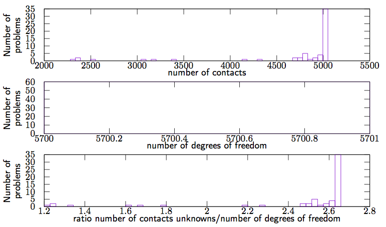

Stack of 945 spheres in a box
============================================================

Authors: V. Acary (INRIA Rhône–Alpes)

Date: 21/09/2015

Software: LMGC90 (original simulation of LMGC90 development team)

        

coefficient of friction 0.8

number of problems 60

number of degrees of freedom 5700

number of contacts [2322:5037] 

required accuracy 1e-8

This set of 60 problems has been generated by LMGC90. It simulates the stacking of 945 spheres in a box under gravity.

todo : more details would be useful

The script that generates this example can be obtained from the Siconos development team. On the following figure,  distribution of the number of contacts, the number of d.o.f and the ratio number of contacts unknowns/number of d.o.f are illustrated.

        

