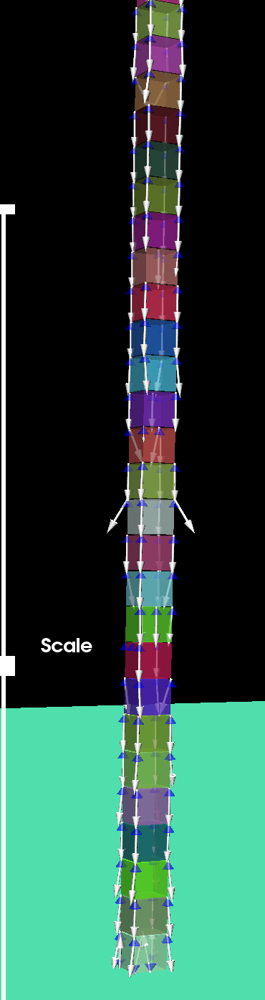
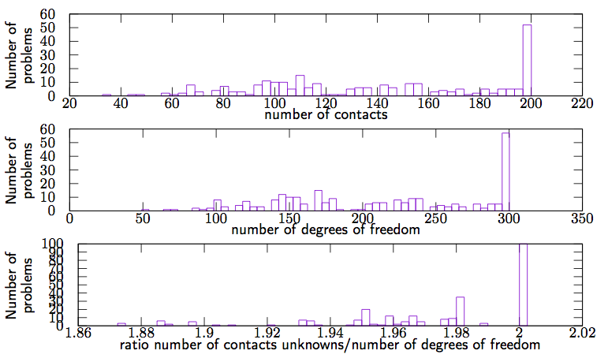

50 boxes stacked under gravity
==============================================

Authors: V. Acary, M. Brémond.  (INRIA Rhône–Alpes)

Date: 10/02/2014

Software: Siconos

        
	 	

coefficient of friction 0.7

number of problems 255

number of degrees of freedom [6:300]

number of contacts [0:200] 

required accuracy 1e-8

This set of 255 problems has been generated by Siconos with the help of Bullet contact detection library.

This set of 255 problems has been generated by Siconos with the help of Bullet contact detection library. It simulates 50 boxes stacked under gravity. The mass of the box is 1kg and the size is 2 × 2m. The script that generates this example can be obtained from the Siconos development team. On the figure below, the distribution of the number of contacts, the number of d.o.f and the ratio number of contacts unknowns/number of d.o.f are illustrated.

        

