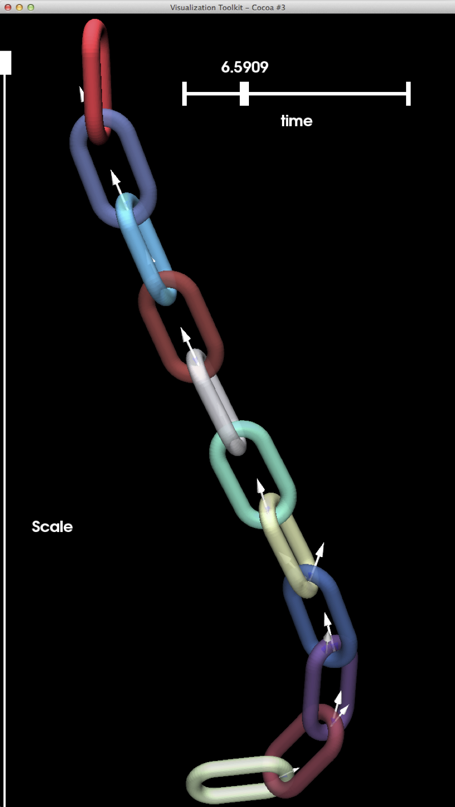

Hanging chain with initial velocity at the tip
==============================================

Authors V. Acary, M. Brémond.  (INRIA Rhône–Alpes)

Date 10/02/2014

Software Siconos

        

coefficient of friction 0.3

number of problems 242

number of degrees of freedom [48:60]

number of contacts [8:28] 

required accuracy 1e-8

This set of 242 problems has been generated by Siconos with the help of Bullet contact detection library. It simulates an hanging chain with initial velocity at the tip. The chain is composed of 11 elements with the same geometry given by a unique mesh. The mass of each component is 1kg for a length of 13.7m and a thickness of 7.6m . The initial velocity at the tip is 50mm/s.

The script that generates this example can be obtained from the Siconos development team. On the following figure,  distribution of the number of contacts, the number of d.o.f and the ratio number of contacts unknowns/number of d.o.f are illustrated.

        

