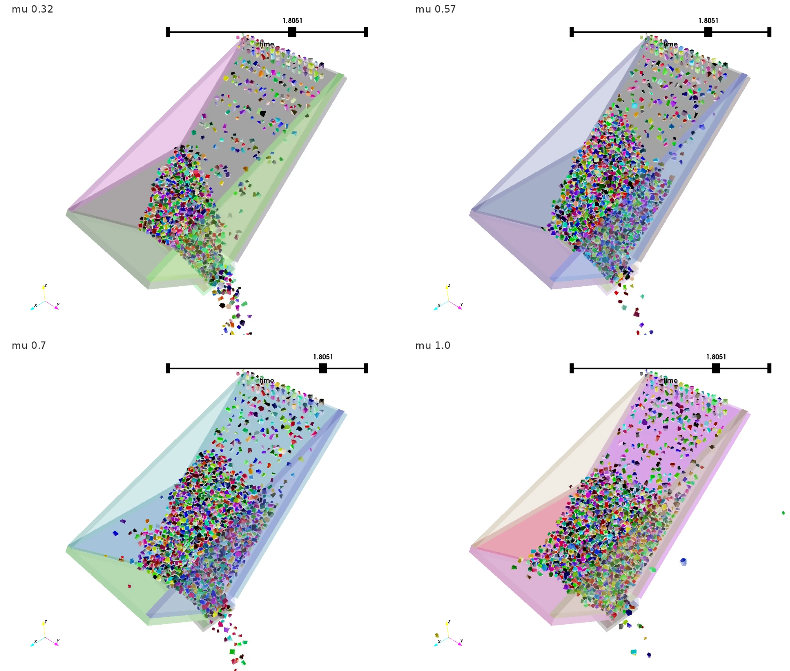

Flow of 4000 ramdom polyedra with 10 facets into a chute
========================================================

Authors: V. Acary, S. Sinclair  (INRIA Rhône–Alpes, INRIA Chile)

Date: 01/08/2016

Software: Siconos

        

coefficient of friction 1.0

number of problems 

number of degrees of freedom

number of contacts

required accuracy 1e-4

This set of  problems has been generated by Siconos with the help of Bullet contact detection library. It simulates the flow of 4000 polyhedra into a chute

more details

 The script that generates this example can be obtained from the Siconos development team. On the figure below, the distribution of the number of contacts, the number of d.o.f and the ratio number of contacts unknowns/number of d.o.f are illustrated.

        

