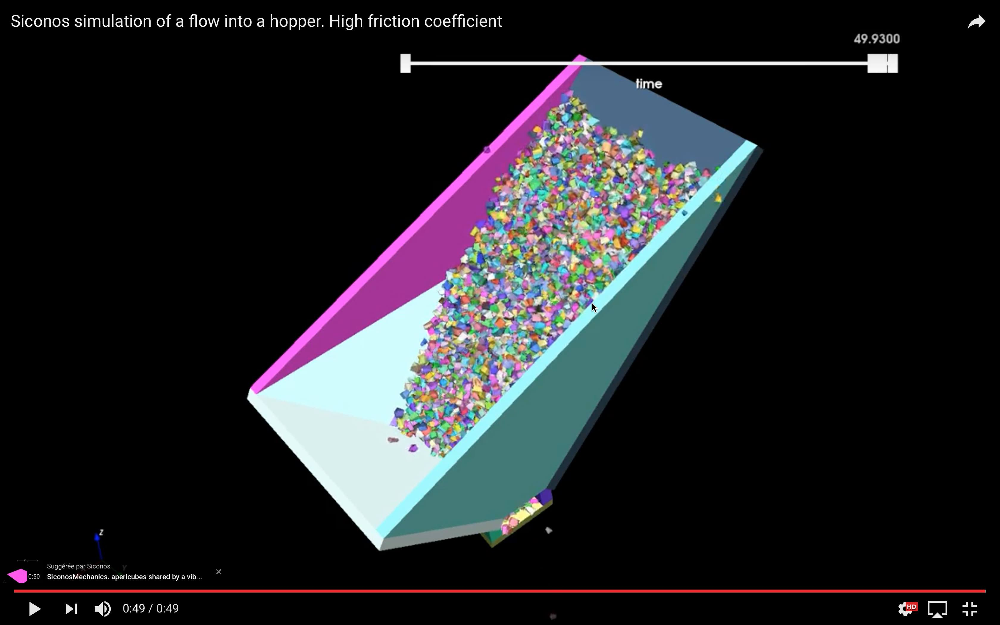

A collection of difficult local (one contact) problems 
======================================================

Authors: V. Acary,  (INRIA Rhône–Alpes)

Date: 01/07/2016

Software: Siconos

        

coefficient of friction 1.0

number of problems 834

number of degrees of freedom [6:6]

number of contacts [1]

required accuracy 1e-4

This set of 834 problems has been generated by Siconos with the help of Bullet contact detection library. It simulates 100 randomly created polyhedra with ten facets flowing into a hopper.

The script that generates this example can be obtained from the Siconos development team. On the figure below, the distribution of the number of contacts, the number of d.o.f and the ratio number of contacts unknowns/number of d.o.f are illustrated.

