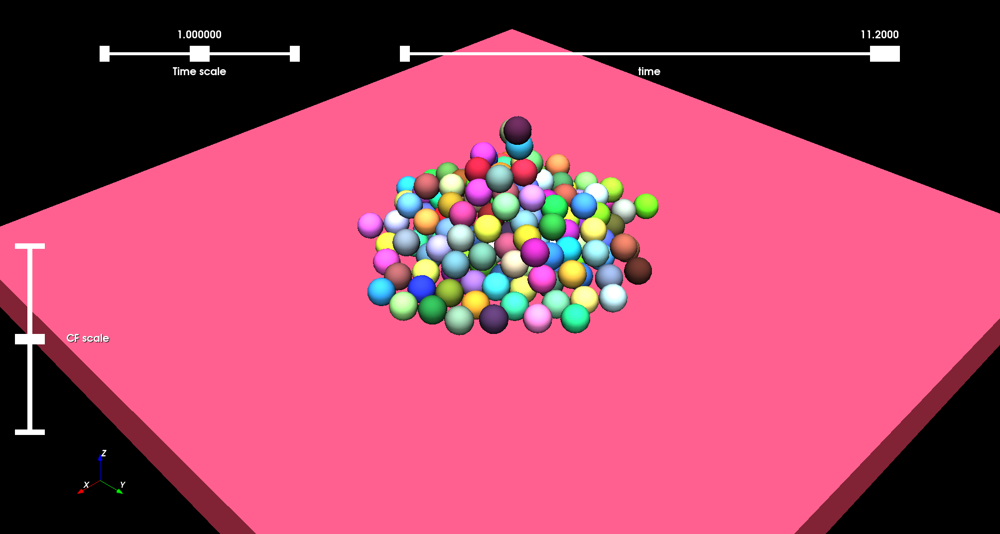

250 spheres with rolling friction stacked under gravity
==============================================

Authors: V. Acary,  (INRIA Rhône–Alpes)

Date: 31/03/2021

Software: Siconos

This set of 200 problems has been generated by Siconos with the help of Bullet contact detection library. It simulates 250 spheres stacked under gravity with rolling friction.

The script for the generation can be found here https://github.com/FrictionalContactLibrary/fclib-scripts/blob/master/siconos/Global/Rolling/spheres_pile_MoreauJeanGOSI.py

