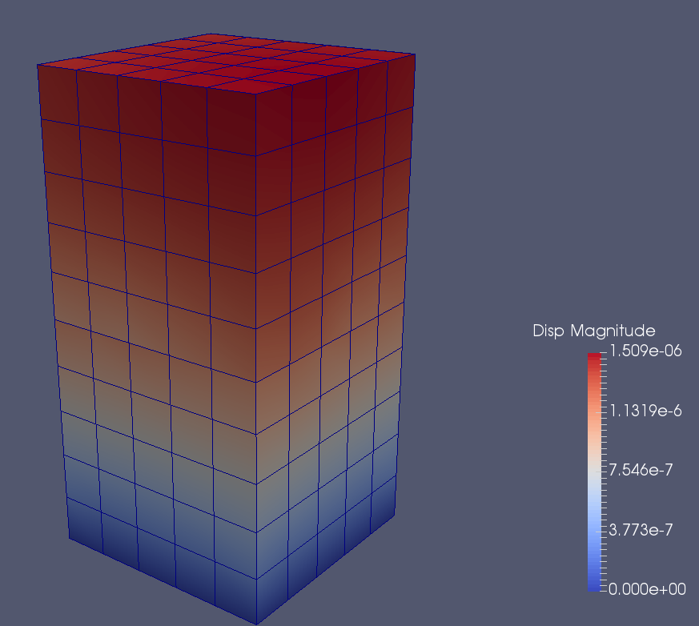
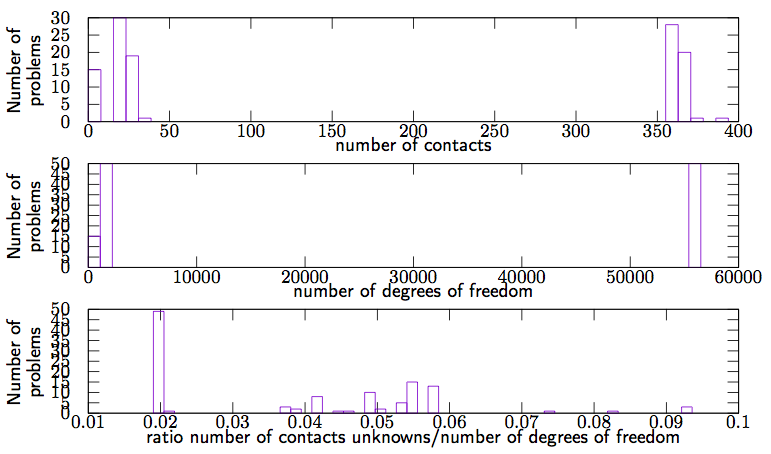

Compression of two FEM cubes 
=============================

Authors: V. Acary (INRIA Rhône–Alpes)

Date: 01/07/2016

Software: LMGC90 (original simulation of LMGC90 development team)

        

coefficient of friction 0.3

number of problems 115

number of degrees of freedom {162,1296,55566}

number of contacts  { [3,5], [17,36], [361,378]}

required accuracy 1e-8

This set of 58 problems has been generated by LMGC90. It simulates the compression of two elactic cubes meshed by H8 finite elements. The cubes by 2x2x2, 5x5x5 or 20x20x20 elements

todo : more details.

The script that generates this example can be obtained from the Siconos development team. On the following figure,  distribution of the number of contacts, the number of d.o.f and the ratio number of contacts unknowns/number of d.o.f are illustrated.

        

