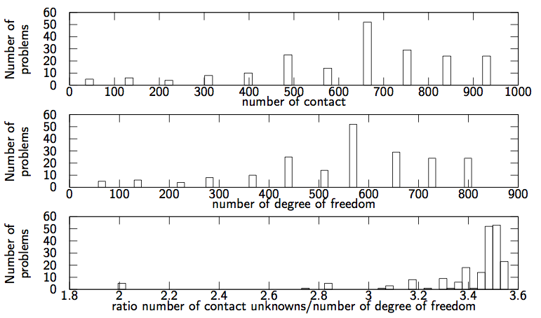

A tower of 132 Kaplas
==============================================

Authors: V. Acary, M. Brémond.  (INRIA Rhône–Alpes)

Date: 10/02/2014

Software: Siconos

        

coefficient of friction 0.7

number of problems 201

number of degrees of freedom [72:792]

number of contacts [48:933]

required accuracy 1e-8

This set of 201 problems has been generated by Siconos with the help of Bullet contact detection library. It simulates 132 Kaplas dropped onto a ground. The Mass of each capsule is ... . The script that generates this example can be obtained from the Siconos development team. On the figure below, the distribution of the number of contacts, the number of d.o.f and the ratio number of contacts unknowns/number of d.o.f are illustrated.

        

