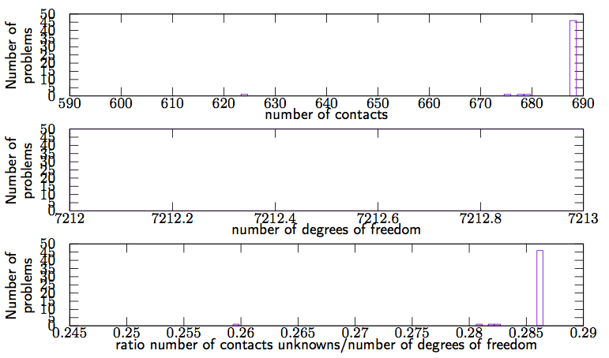

Shear test on a low wall meshed by FEM
======================================

Authors: V. Acary (INRIA Rhône–Alpes), F. Dubois (LMGC)

Date: 01/10/2016

Software: LMGC90 (original simulation of LMGC90 development team)

        

coefficient of friction 0.83

number of problems 50

number of degrees of freedom 7212

number of contacts [624:688] 

required accuracy 1e-4

This set of 50 problems has been generated by LMGC90. It simulates a shear test of a low wall meshed by H8 finite elements.

todo : more details.

The script that generates this example can be obtained from the Siconos development team. On the following figure,  distribution of the number of contacts, the number of d.o.f and the ratio number of contacts unknowns/number of d.o.f are illustrated.

        

