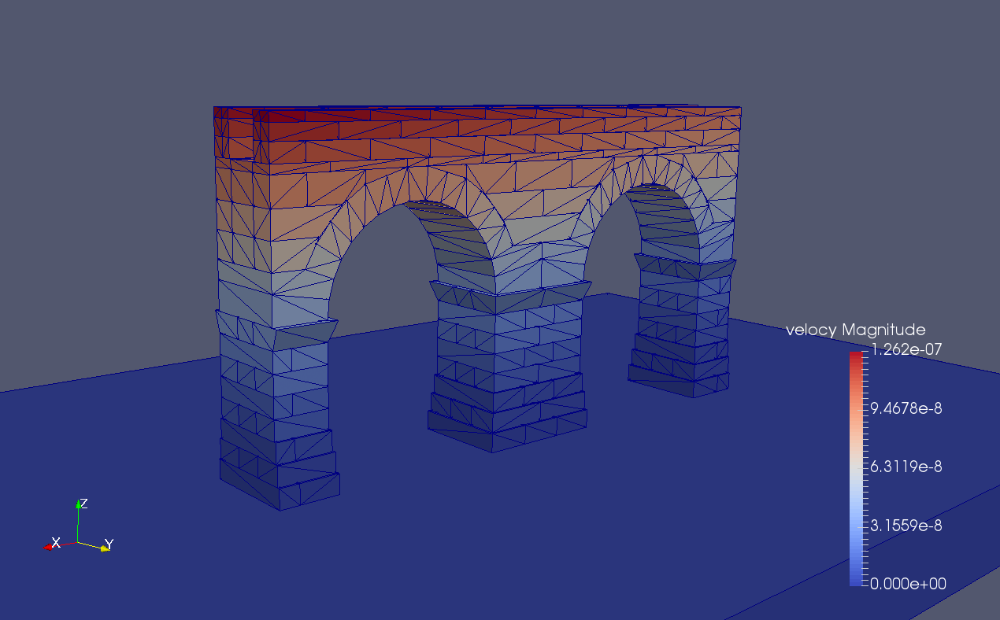
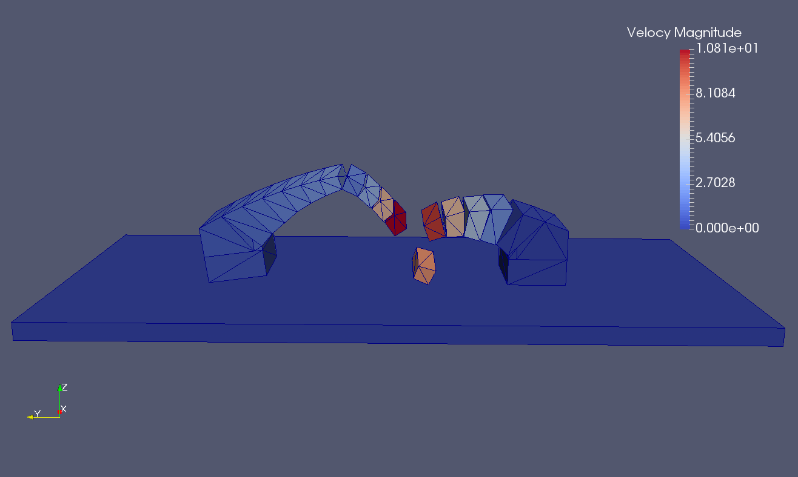
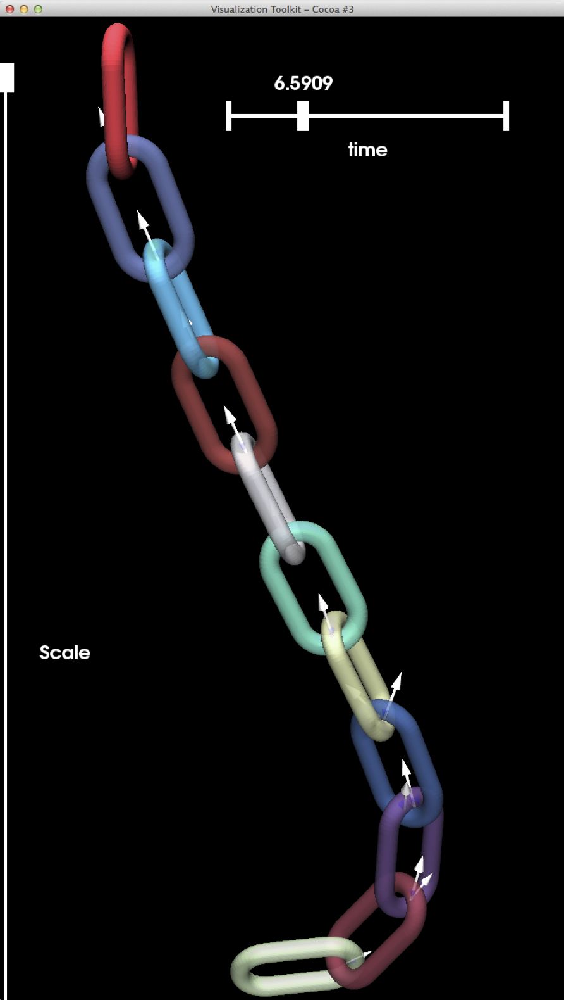
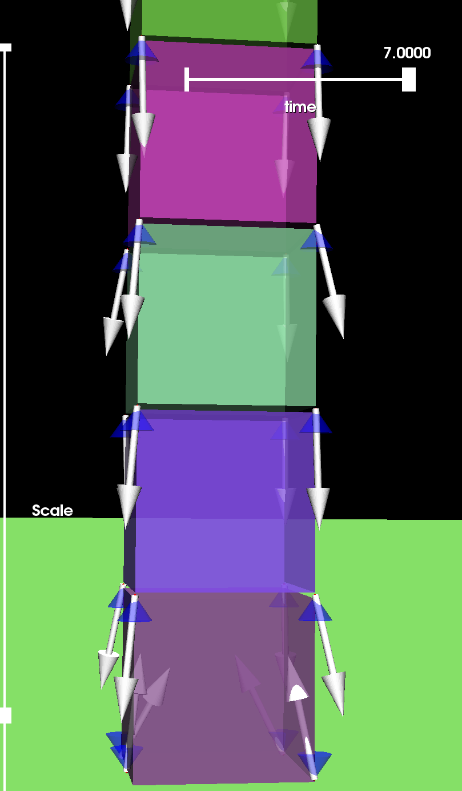
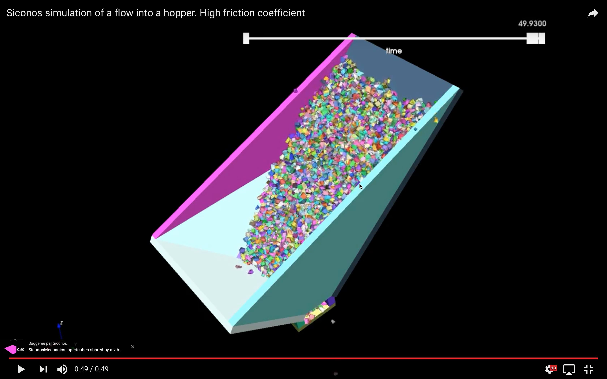
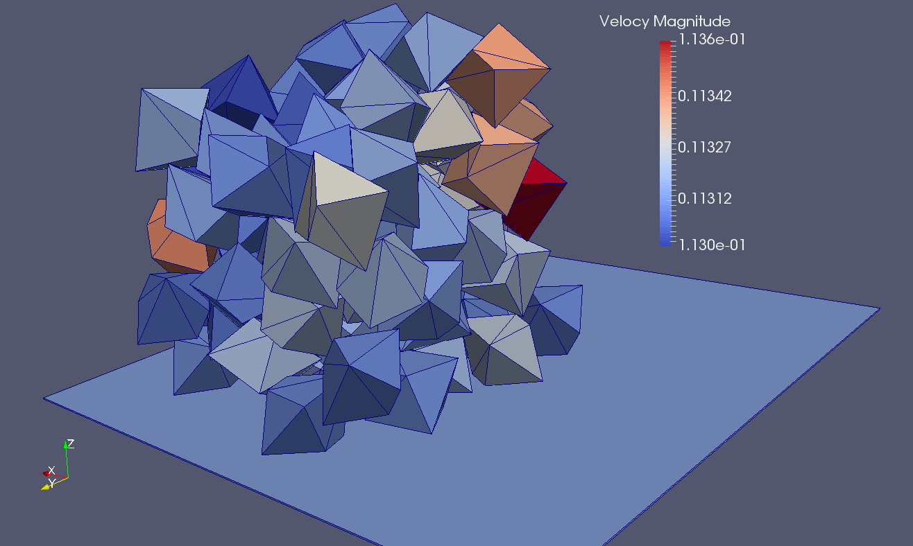
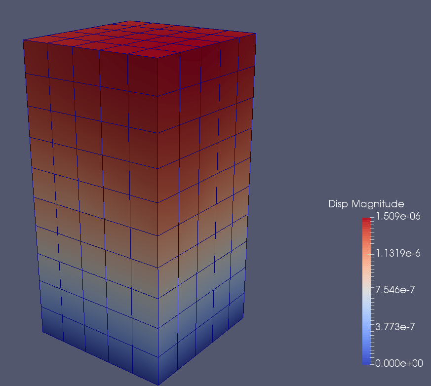
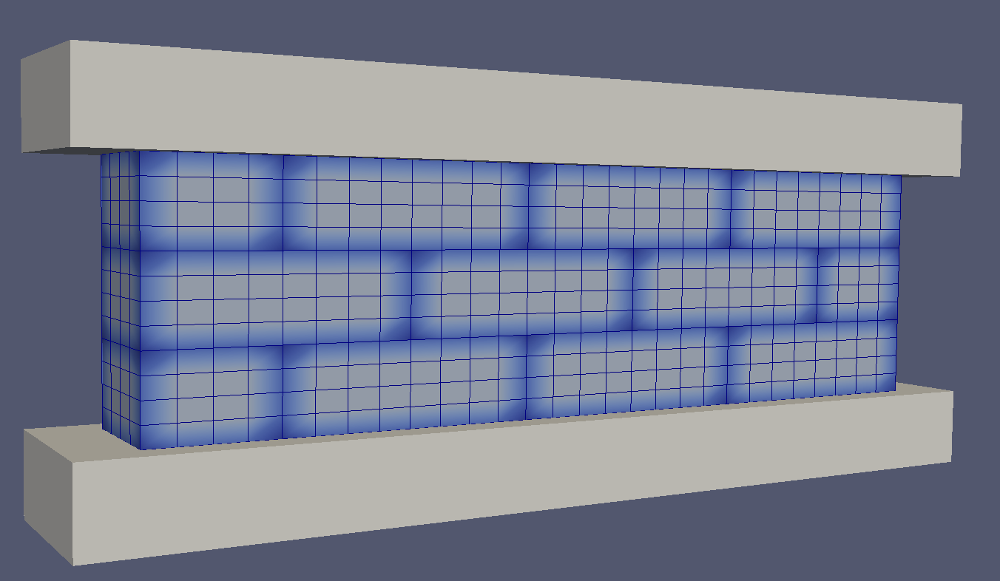
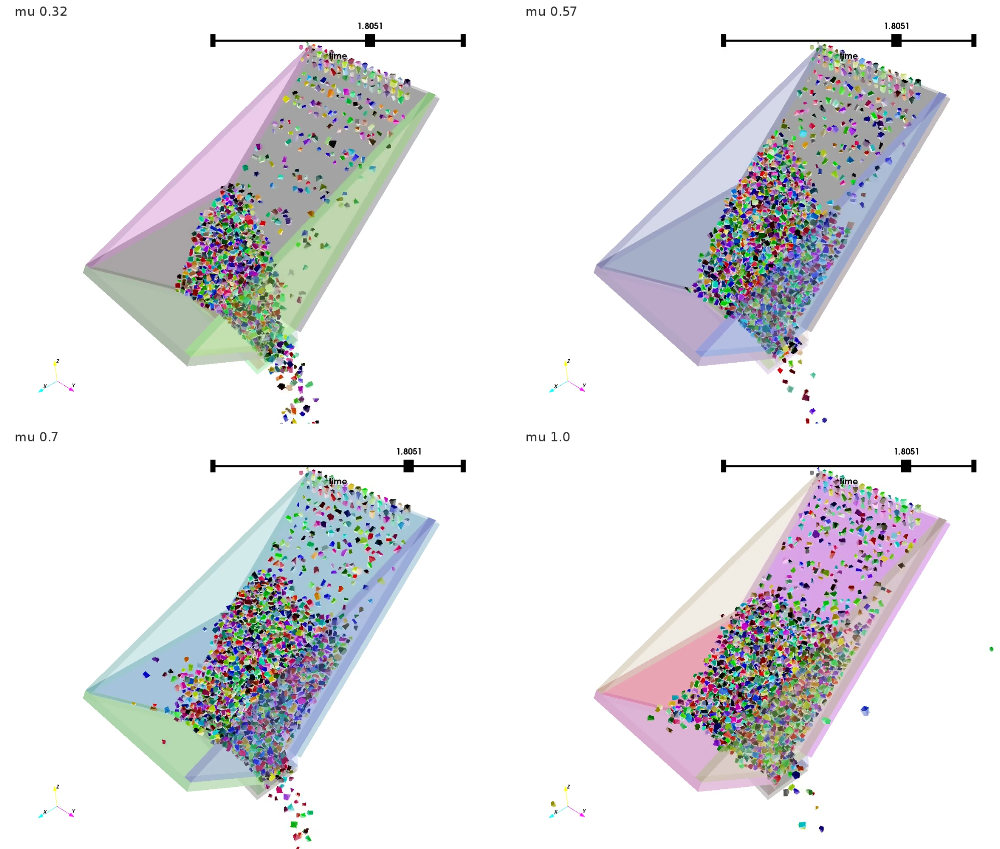

fclib-library repository
========================

## A open collection of frictional contact problems

        
         
        
        
        
        
        
        
        
        
        

This repository contains the problem files of the fclib library. 

The hdf5 file can be read with the fclib API in C or in Python. The code can be found at [FrictionalContactLibrary/fclib](https://github.com/FrictionalContactLibrary/fclib)

More information is avalaible on the [website of the fclib project](https://frictionalcontactlibrary.github.io/index.html)

What is fclib ?
---------------
fclib is
 * an open source collection of Frictional Contact (FC) problems stored in a specific HDF5 format,
 * an open source light implementation of Input/Output functions in C Language to read and write problems.
 
The goal of this work is to set up a collection of 2D and 3D Frictional Contact (FC) problems in order to
 * set up a list of benchmarks,
 * provide a standard framework for testing available and new algorithms,
 * share common formulations of problems in order to exchange data.

What is a Frictional contact problem ?
--------------------------------------

A Frictional contact problem is algebraic problem obtained after possible time and space discretizations of problems
of mechanics of solid involving contact and Coulomb's friction. The mathematical structure of the problem is 
a second-order cone complementarity problem. For more details, you could have a look to the fclib specifications in

Vincent Acary, Maurice Brémond, Tomasz Koziara, Franck Pérignon. 
FCLIB: a collection of discrete 3D Frictional Contact problems. 
[Technical Report] RT-0444, INRIA. 2014, pp.34. <hal-00945820v2>
https://hal.inria.fr/hal-00945820v2/document

git lfs
-------
It uses git lfs  for the versioning and the cloning. By using git sparse-checkout system, you can clone only what you need.

