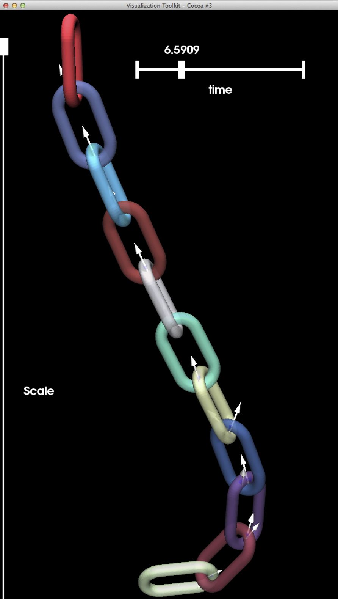
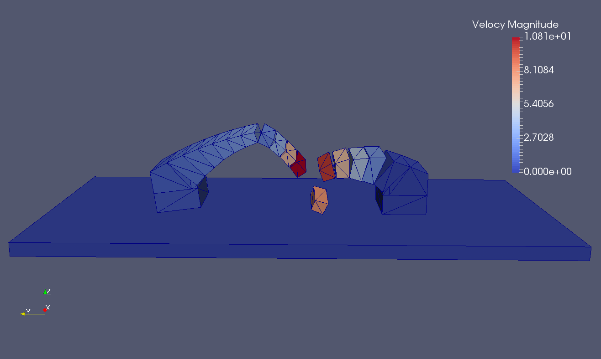

fclib-library repository
========================

This repository contains the problem files of the fclib library. It uses git lfs so for versioning and cloning ( only what you ant if needed).

It is closely related to the fclib API for reading and writing the problem file that you can find at (https://github.com/FrictionalContactLibrary/fclib)

More information are avalaible at (https://frictionalcontactlibrary.github.io/index.html)

        
        
        
        
        
        

