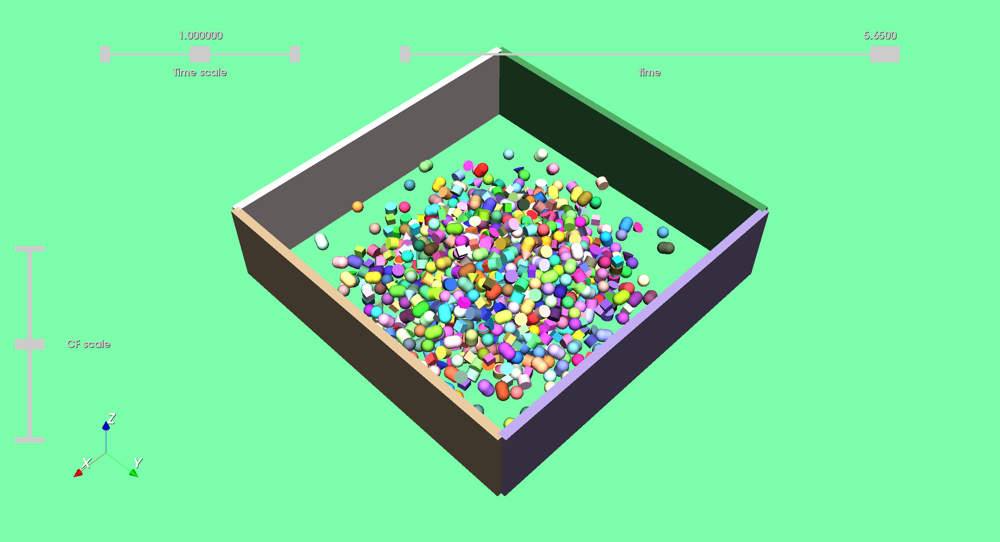

Soup of 1000 primitives stacked under gravity with rolling friction
==============================================

Authors: V. Acary (INRIA Rhône–Alpes)

Date: 25/03/2024

Software: Siconos

        

